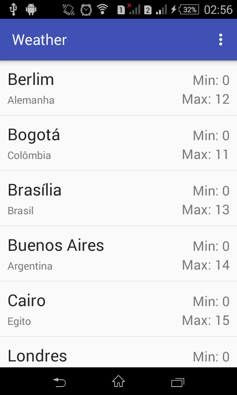
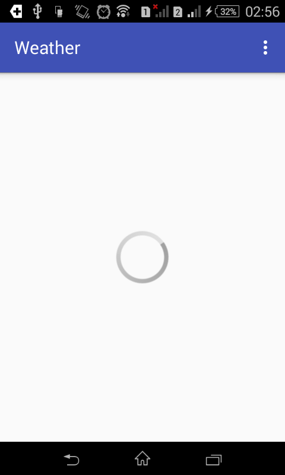
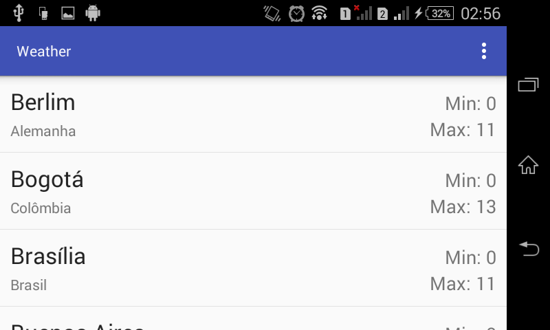

<h1>Aplicativo que permite mostrar tempo em diferentes paises</h1>

     Este aplicativo foi feito apartir de um exercicio proposto na SoftBlue.

     Ele conecta com um WebService que proporciona para ele uma lista de cidades ao redor do mundo com.
      Esta lista é ficticia. Ou seja as temperaturas são inventadas. 

 
Aqui fica a lista. Logo que entra na aplicação
 

 
É feito uma atualização. O intuito desta atualização era para ser demorada, e é, porem é posivel deixar o app mais otimizado.
 

 
Esta aplicação se adapta a tela do usuario. Então pode executar sem medo.
 

     Como vocês podem ver é uma aplicação bem simples.
     Porem permite fazer dar um bom aprendizado.

     Agradeço a todos da softblue pelo aprendizado

